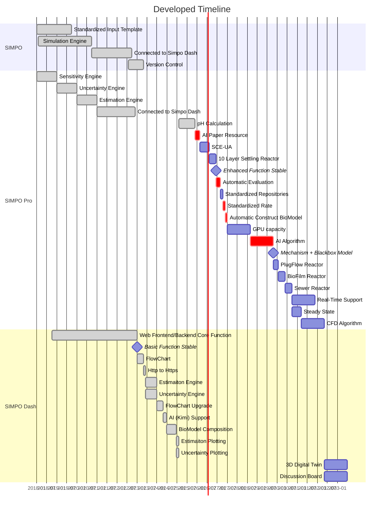

```mermaid
gantt
    dateFormat  YYYY-MM-DD
    axisFormat  %Y-%m
    tickInterval 6month
    todayMarker on
    title       Developed Timeline
    excludes    weekends
    section SIMPO
    Standardized Input Template             :done, a1a, 2018-01-01, 2019-10-01
    Simulation Engine                       :done, a1b, 2018-02-01, 2020-10-01
    Connected to Simpo Dash                 :done, a2, after a1b, 2022-10-01
    Version Control                         :done, a12, 2022-08-01, 2023-05-01
    section SIMPO Pro
    Sensitivity Engine                      :done, b1a, 2018-01-01, 2019-01-01
    Uncertainty Engine                      :done, b1b, after b1a, 2020-01-01
    Estimation Engine                       :done, b1c, after b1b, 2021-01-01
    Connected to Simpo Dash                 :done, b2, after b1c, 2022-12-01

    pH Calculation                          :done, b3, after c4a02, 2025-11-27
    AI Paper Resource                       :crit, b3a, after b3, 60d

    SCE-UA                                  :c4a03a, after b3a, 120d
    10 Layer Settling Reactor               :b4, after c4a03a, 90d
    Enhanced Function Stable                :milestone, mc2, after b4, 0d

    Automatic Evaluation                    :crit, c4a04, after b4, 60d
    Standardized Repositories               :c5Repositories, after c4a04, 30d
    Standardized Rate                       :crit, c5Rate, after c5Repositories, 30d
    Automatic Construct BioModel            :crit, c5, after c5Rate, 30d

    GPU capacity                            :c9, after c5, 300d
    AI Algorithm                            :crit, c6, after c9, 300d
    Mechanism + Blackbox Model              :milestone, mc3, after c6, 0d
    PlugFlow Reactor                        :c4c, after c6, 60d
    BioFilm Reactor                         :c4d, after c4c, 90d
    Sewer Reactor                           :c4e, after c4d, 90d
    Real-Time Support                       :c5a, after c4e, 300d
    Steady State                            :c4StedayState, after c4e, 120d
    CFD Algorithm                           :c7, after c4StedayState, 300d

    section SIMPO Dash
    Web Frontend/Backend Core Function      :done, c1, 2018-10-01, 2023-01-01
    Basic Function Stable                   :milestone, mc1, after c1, 0d
    FlowChart                               :done, c12, after c1, 90d
    Http to Https                           :done, c2, 2023-05-01, 2023-06-10
    Estimaiton Engine                       :done, c3, after c2, 2023-12-31
    Uncertainty Engine                      :done, c4, after c2, 2023-12-31
    FlowChart Upgrade                       :done, c40, after c4, 2024-04-23
    AI (Kimi) Support                       :done, c40kimi, after c40, 2024-06-23
    BioModel Composition                    :done, c4aComposition, after c40kimi, 2024-12-18

    Estimaiton Plotting                     :done, c4a01, after c4aComposition, 2025-01-30
    Uncertainty Plotting                    :done, c4a02, after c4aComposition, 2025-01-30


    3D Digital Twin                         :c8, after c7, 300d
    Discussion Board                        :c10, after c7, 300d
```